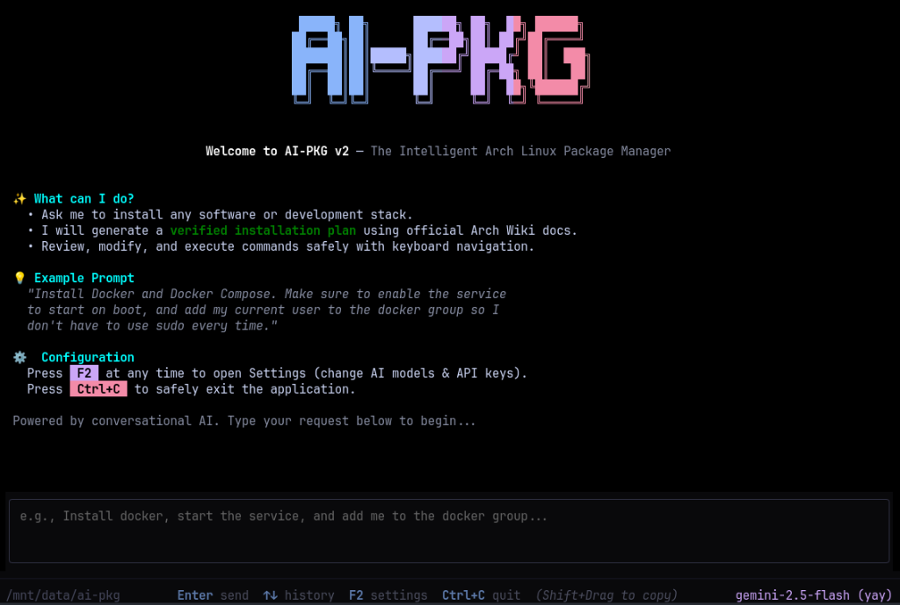
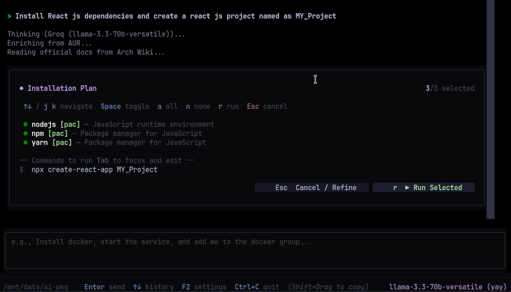
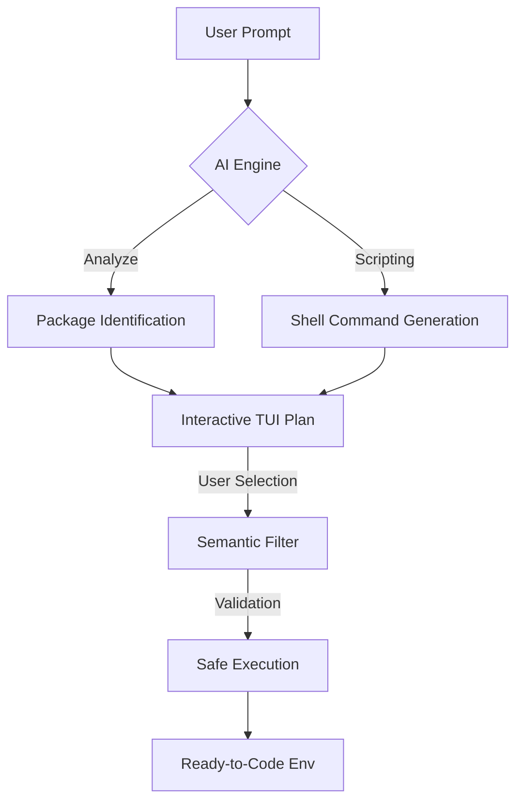

<p align="center">
  <a href="https://github.com/rohankrsingh/ai-pkg">
    
  </a>
</p>

<h1 align="center">ai-pkg</h1>

<p align="center">
  <strong>The Intelligent Development Environment Architect for Arch Linux</strong>
</p>

<p align="center">
  <a href="#-key-features">Key Features</a> •
  <a href="#-how-it-works">How it Works</a> •
  <a href="#-installation">Installation</a> •
  <a href="#-getting-started">Getting Started</a> •
  <a href="#-tech-stack">Tech Stack</a> •
  <a href="#-roadmap">Roadmap</a>
</p>


## 🚀 Overview

**ai-pkg** is not just a package manager wrapper; it's a bridge between your intent and a fully functional development environment. By leveraging advanced LLMs (Gemini, OpenAI, Groq, and Ollama), it understands complex requests in plain English and transforms them into a curated, safe, and efficient installation plan.

> "Set up a high-performance React frontend with Tailwind and a Python/FastAPI backend."

With one command, **ai-pkg** identifies the necessary Arch/AUR packages, scripts the environment setup, and provides a sleek TUI to review every single step before execution.

| Launch & Chat | Plan & Execute |
|:---:|:---:|
|  |  |


## 🧭 Table of Contents

- [Key Features](#-key-features)
- [How it Works](#-how-it-works)
- [Installation](#-installation)
- [Getting Started](#-getting-started)
- [Tech Stack](#-tech-stack)
- [Configuration](#-configuration)
- [Roadmap](#-roadmap)
- [License](#-license)


## ✨ Key Features

### 🖥️ Modern TUI Experience

Built with **Textual**, the interface is designed for power users. It features a responsive layout, Catppuccin-inspired aesthetics, and smooth keyboard-driven navigation.

### 🤖 Multi-LLM Intelligence

Swap backends on the fly. Whether you prefer the reasoning of **GPT-4o**, the speed of **Gemini 2.5 Flash**, the low-latency of **Groq**, or the privacy of **Local Ollama**, ai-pkg supports them all.

### 🛡️ Semantic Safety Net

The built-in **AI Filtering System** is unique: if you deselect a package from the proposed plan, the AI automatically scans the remaining shell commands and strips away any logic that depended on the removed package. No more broken environment scripts!


## 🧠 How it Works




## 📦 Installation

### The Arch Way (AUR)

Install the binary package via your preferred AUR helper:

```bash
yay -S ai-pkg-bin
# OR
paru -S ai-pkg-bin
```

### From Source

```bash
git clone https://github.com/rohankrsingh/ai-pkg.git
cd ai-pkg
./install.sh
```


## 🛠️ Getting Started

Launch the interface by simply running:

```bash
ai-pkg
```

### ⌨️ TUI Navigation

| Key | Action |
|-----|--------|
| `F2` | **Settings**: Configure LLM providers and API keys |
| `↑` / `↓` | **History**: Navigate prompt history in the chat |
| `Space` | **Toggle**: Select/Deselect packages in the plan |
| `r` | **Run**: Execute the finalized plan |
| `Esc` | **Cancel**: Return to chat or exit current view |
| `Ctrl+C` | **Quit**: Safe exit |


## ⚙️ Configuration

The application is fully configurable via the TUI (**F2**) or by editing the config file directly:

**Location**: `~/.config/ai-pkg/config.toml`

```toml
[ai]
model = "gemini" # choices: gemini, openai, groq, ollama
gemini_api_key = "..."
gemini_model = "gemini-2.5-flash"
groq_api_key = "..."
# ... other provider settings
```


## 🛠️ Tech Stack

- **Language**: [Python 3.9+](https://www.python.org/)
- **TUI Framework**: [Textual](https://textual.textualize.io/)
- **Styling**: [Rich](https://rich.readthedocs.io/)
- **HTTP Client**: [HTTPX](https://www.python-httpx.org/)
- **Serialization**: [TOMLi](https://github.com/hukkin/tomli)


## 🗺️ Roadmap

- [ ] **Docker Integration**: Automatically generate `Dockerfile` and `docker-compose.yml` based on the plan.
- [ ] **Community Presets**: Share and download community-curated environment templates.
- [ ] **Plugin System**: Support custom post-install scripts and hooks.
- [ ] **GUI Wrapper**: A lightweight Electron/Desktop wrapper for non-terminal enthusiasts.


## 🔄 Updates & Maintenance

Stay current with the latest features:

```bash
yay -Syu ai-pkg-bin
```

To remove the application and its local environments:

```bash
./uninstall.sh
```


<details>
<summary><b>📜 Previous CLI Version Documentation (v1)</b></summary>

## ✨ Why AIPkg?

- 🧠 **AI-Powered Intelligence**: Understands context and recommends the perfect package combinations
- 🎯 **Smart Package Selection**: No more manual package hunting - AI picks the right tools for your needs
- 🛠️ **Instant Environment Setup**: Turn ideas into ready-to-code environments in seconds
- 🏗️ **Project Bootstrapping**: Creates and configures new projects with industry best practices
- ⚡ **AUR Superpowers**: Seamless integration with both official repos and AUR
- 🤝 **Flexible Installation**: Works with both `yay` and `paru` - your choice!
- 🧪 **Safe Preview Mode**: See exactly what will happen before making any changes
- 🎨 **Framework Agnostic**: Works with any tech stack - React, Vue, Django, Express, you name it!

## 📦 Installation (v1)

### Via AUR (Recommended)

Install directly from the AUR using your preferred helper:

```bash
yay -S ai-pkg-bin
# or
paru -S ai-pkg-bin
```

### Via GitHub

```bash
git clone https://github.com/rohankrsingh/ai-pkg.git
cd ai-pkg
./install.sh
```

## 🔧 Setup

Set up your Gemini API key (required for v1):

```bash
export GEMINI_API_KEY=your_api_key_here
```

For permanent setup, add the above line to your `~/.bashrc` or `~/.zshrc`.

## 🚀 Usage (v1)

Experience the legacy CLI-driven setup:

```bash
# Create a new React project with modern stack
ai-pkg "set up a react js app as test-app with tailwind, zod, react hook form"

# Set up a data science environment
ai-pkg "create a python data science environment with jupyter, pandas, and scikit-learn"

# Set up a development environment for backend
ai-pkg "set up nodejs backend environment with express, typescript and mongodb"

# Preview mode (shows what would be installed)
ai-pkg "set up a vue.js development environment" --dry-run
```

The AI will:

1. 📋 Analyze your requirements
2. 🎯 Select the appropriate packages
3. ⚙️ Configure the environment
4. 🚀 Set up the project structure (if requested)
5. 📝 Provide any necessary post-installation instructions

## ⚙️ Options (v1)

| Option | Description |
|--------|-------------|
| `--dry-run` | Preview commands without executing them |
| `--yes` | Auto-confirm all prompts |
| `--run-env` | Run environment setup steps automatically |
| `--aur-helper` | Choose AUR helper (`yay` or `paru`) |

Environment variables:

- `AI_PKG_AUR_HELPER`: Set default AUR helper (yay/paru)
- `GEMINI_API_KEY`: Your Gemini API key

</details>


## 📝 License

Distributed under the MIT License. See `LICENSE` for more information.

<p align="right">(<a href="#top">back to top</a>)</p>
